NotePad
This is an AndroidStudio rebuild of google SDK sample NotePad

功能介绍

一、初始应用的功能

1.1 新建笔记和编辑笔记
**功能介绍**：用户可以创建新的笔记并进行编辑，支持多行文本输入，提供类似纸张的编辑体验。
**实现思路**：通过 Intent 区分新建和编辑操作，使用 ContentProvider 处理数据的增删改查。
[新建笔记和编辑笔记] 实现效果截图：
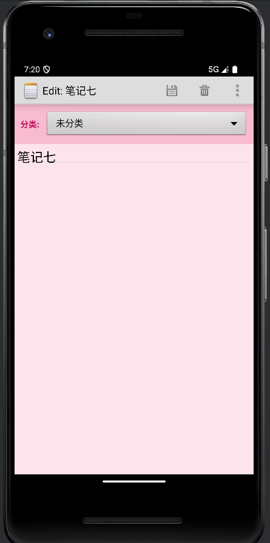

1.2 编辑标题
**功能介绍**：用户可以为每个笔记设置标题，方便后续查找和管理。
**实现思路**：将标题和内容分开存储，提供独立的标题编辑界面。
[编辑标题] 实现效果截图：

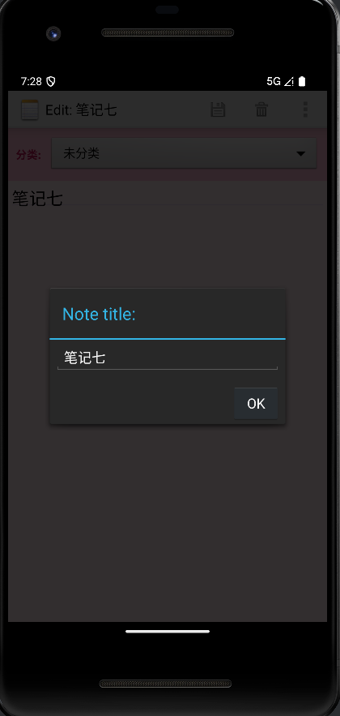
1.3 笔记列表
**功能介绍**：所有创建的笔记会以列表形式展示，方便用户浏览和选择。
**实现思路**：使用 ListView 展示笔记列表，通过 CursorAdapter 绑定数据库数据。
[笔记列表] 实现效果截图：
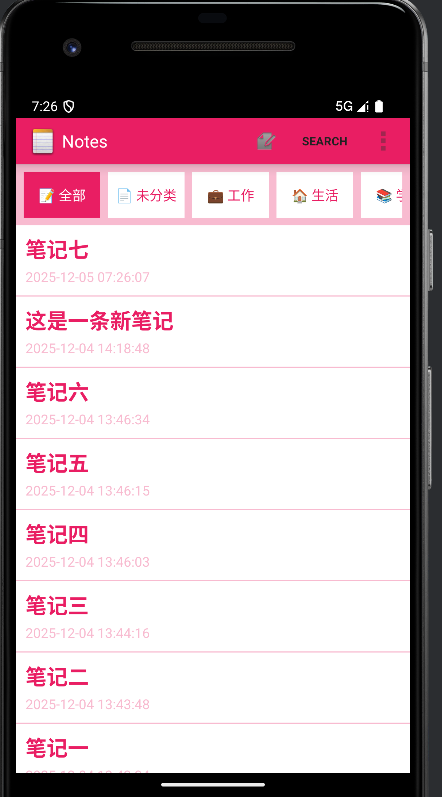

二、拓展基本功能

2.1 笔记条目增加时间戳显示
**功能介绍**：每条笔记会显示最后修改的时间，帮助用户了解笔记的更新情况。
**实现思路**：在笔记列表项中添加时间显示控件，从数据库中获取修改时间并格式化显示。
**技术实现**：
1. **数据库字段定义**：在 NotePad 类中定义修改时间字段
2. **数据存储**：在 NotePadProvider 和 NoteEditor 中处理时间戳的保存
3. **布局文件**：在 noteslist_item.xml 中添加时间显示控件
4. **列表适配器**：在 NotesList.java 的 setAdapterFromCursor 方法中格式化并显示时间戳

**核心代码**：

1. **数据库字段定义 (NotePad.java)**
```java
/**
 * Column name for the modification timestamp
 * <P>Type: INTEGER (long from System.curentTimeMillis())</P>
 */
public static final String COLUMN_NAME_MODIFICATION_DATE = "modified";
```

2. **数据存储 (NotePadProvider.java)**
```java
@Override
public Uri insert(Uri uri, ContentValues initialValues) {
    // ... 其他代码 ...
    
    // Gets the current system time in milliseconds
    Long now = Long.valueOf(System.currentTimeMillis());

    // If the values map doesn't contain the creation date, sets the value to the current time.
    if (values.containsKey(NotePad.Notes.COLUMN_NAME_CREATE_DATE) == false) {
        values.put(NotePad.Notes.COLUMN_NAME_CREATE_DATE, now);
    }

    // If the values map doesn't contain the modification date, sets the value to the current time.
    if (values.containsKey(NotePad.Notes.COLUMN_NAME_MODIFICATION_DATE) == false) {
        values.put(NotePad.Notes.COLUMN_NAME_MODIFICATION_DATE, now);
    }
    
    // ... 插入数据到数据库 ...
}
```

3. **数据更新 (NoteEditor.java)**
```java
private final void updateNote(String text, String title) {
    // Sets up a map to contain values to be updated in the provider.
    ContentValues values = new ContentValues();
    values.put(NotePad.Notes.COLUMN_NAME_MODIFICATION_DATE, System.currentTimeMillis());
    
    // ... 更新其他字段 ...
    
    // ... 执行更新操作 ...
}
```

4. **布局文件 (noteslist_item.xml)**
```xml
<TextView
    android:id="@+id/text_date"
    android:layout_width="match_parent"
    android:layout_height="wrap_content"
    android:textAppearance="?android:attr/textAppearanceSmall"
    android:textColor="#F8BBD0"
    android:paddingTop="4dp" />
```

5. **列表适配器 (NotesList.java)**
```java
private void setAdapterFromCursor(Cursor cursor) {
    // The names of the cursor columns to display in the view
    String[] dataColumns = { NotePad.Notes.COLUMN_NAME_TITLE, NotePad.Notes.COLUMN_NAME_MODIFICATION_DATE };
    
    // The view IDs that will display the cursor columns
    int[] viewIDs = { android.R.id.text1, R.id.text_date };
    
    // Create adapter with custom bindView
    getListView().setAdapter(new SimpleCursorAdapter(this, R.layout.noteslist_item, cursor,
            dataColumns, viewIDs) {
        @Override
        public void bindView(View view, Context context, final Cursor cursor) {
            super.bindView(view, context, cursor);
            
            // Get date view
            TextView dateView = (TextView) view.findViewById(R.id.text_date);
            
            // Get timestamp from cursor
            long timestamp = cursor.getLong(cursor.getColumnIndex(NotePad.Notes.COLUMN_NAME_MODIFICATION_DATE));
            
            // Format timestamp
            String dateStr = new java.text.SimpleDateFormat("yyyy-MM-dd HH:mm:ss",
                    java.util.Locale.getDefault()).format(new java.util.Date(timestamp));
            dateView.setText(dateStr);
            
            // ... 其他代码 ...
        }
    });
}
```
[笔记时间戳显示] 实现效果截图：
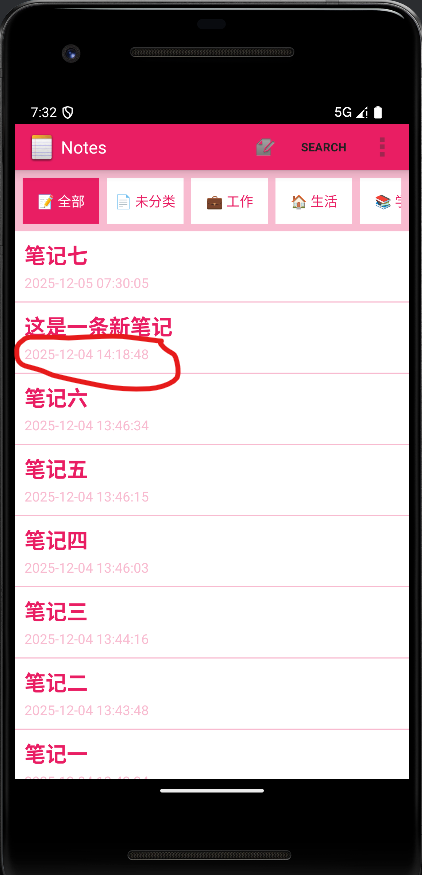
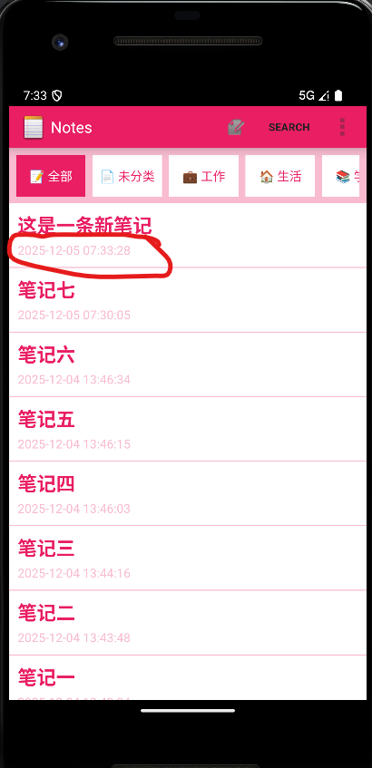

2.2 笔记查询功能（按标题查询）
**功能介绍**：用户可以通过搜索功能，根据笔记标题快速查找所需的笔记。
**实现思路**：提供搜索对话框，用户输入关键词后，通过 ContentProvider 查询匹配的笔记。
**技术实现**：
- 在 `NotesList.java` 中实现 `showSearchDialog` 和 `searchNotes` 方法
- 使用 `AlertDialog` 创建搜索界面
- 通过 `ContentResolver.query()` 方法，使用 `LIKE` 条件进行模糊查询
- 支持同时按标题和内容搜索
**核心代码**：
```java
// 显示搜索对话框
private void showSearchDialog() {
    AlertDialog.Builder builder = new AlertDialog.Builder(this);
    builder.setTitle("搜索笔记");

    final EditText input = new EditText(this);
    input.setHint("输入标题或内容关键词");
    input.setPadding(50, 30, 50, 30);
    builder.setView(input);

    builder.setPositiveButton("搜索", new DialogInterface.OnClickListener() {
        @Override
        public void onClick(DialogInterface dialog, int which) {
            String query = input.getText().toString();
            if (!TextUtils.isEmpty(query)) {
                searchNotes(query);
            }
        }
    });

    builder.setNegativeButton("取消", new DialogInterface.OnClickListener() {
        @Override
        public void onClick(DialogInterface dialog, int which) {
            dialog.cancel();
        }
    });

    builder.show();
}

// 执行搜索操作
private void searchNotes(String query) {
    // 保存搜索查询
    mCurrentSearchQuery = query;

    // 构建查询条件
    StringBuilder selectionBuilder = new StringBuilder();
    java.util.ArrayList<String> selectionArgsList = new java.util.ArrayList<String>();

    // 添加搜索条件
    selectionBuilder.append("(" + NotePad.Notes.COLUMN_NAME_TITLE + " LIKE ? OR " +
              NotePad.Notes.COLUMN_NAME_NOTE + " LIKE ?)");
    String searchPattern = "%" + query + "%";
    selectionArgsList.add(searchPattern);
    selectionArgsList.add(searchPattern);

    // 添加分类筛选条件（如果存在）
    if (mCurrentCategory != null) {
        selectionBuilder.append(" AND " + NotePad.Notes.COLUMN_NAME_CATEGORY + " = ?");
        selectionArgsList.add(mCurrentCategory);
    }

    String selection = selectionBuilder.toString();
    String[] selectionArgs = selectionArgsList.toArray(new String[selectionArgsList.size()]);

    // 执行查询
    Cursor cursor = managedQuery(
        getIntent().getData(),
        PROJECTION,
        selection,
        selectionArgs,
        NotePad.Notes.DEFAULT_SORT_ORDER
    );

    // 设置适配器显示结果
    setAdapterFromCursor(cursor);
}
```
[笔记查询功能] 实现效果截图：
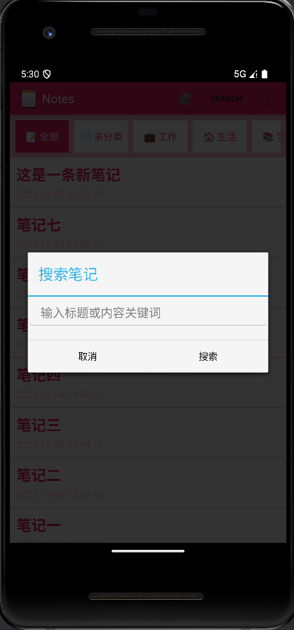
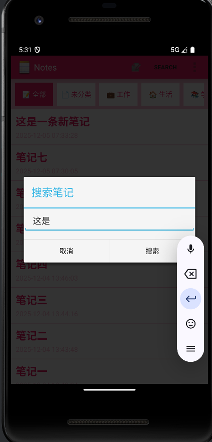
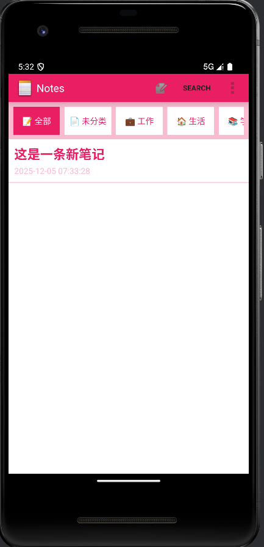
三、拓展附加功能

3.1 笔记分类
**功能介绍**：支持为笔记添加分类标签，方便用户对笔记进行归类管理。
**实现思路**：提供分类选择下拉框，将分类信息存储到数据库中，并支持按分类筛选笔记。
**技术实现**：
- 在 `NoteEditor.java` 中添加分类选择 `Spinner` 控件
- 数据库中使用 `COLUMN_NAME_CATEGORY` 字段存储分类信息
- 在 `NotesList.java` 中实现分类筛选功能，通过按钮切换不同分类
- 使用 `ArrayAdapter` 绑定分类数据到 Spinner
**核心代码**：
```java
// 在 NoteEditor.java 中设置分类选择器
// 获取分类选择器
mCategorySpinner = (Spinner) findViewById(R.id.category_spinner);

// 设置分类适配器
ArrayAdapter<CharSequence> categoryAdapter = ArrayAdapter.createFromResource(
        this, R.array.categories, android.R.layout.simple_spinner_item);
categoryAdapter.setDropDownViewResource(android.R.layout.simple_spinner_dropdown_item);
mCategorySpinner.setAdapter(categoryAdapter);

// 在 NotesList.java 中实现分类筛选
private void setupCategoryButtons() {
    Button btnAll = (Button) findViewById(R.id.btn_all);
    Button btnUncategorized = (Button) findViewById(R.id.btn_uncategorized);
    Button btnWork = (Button) findViewById(R.id.btn_work);
    Button btnLife = (Button) findViewById(R.id.btn_life);
    Button btnStudy = (Button) findViewById(R.id.btn_study);
    Button btnTodo = (Button) findViewById(R.id.btn_todo);

    btnAll.setOnClickListener(new View.OnClickListener() {
        @Override
        public void onClick(View v) {
            loadNotes(null);
            updateButtonStyles(v.getId());
        }
    });

    btnUncategorized.setOnClickListener(new View.OnClickListener() {
        @Override
        public void onClick(View v) {
            loadNotes("未分类");
            updateButtonStyles(v.getId());
        }
    });

    // 其他分类按钮的点击事件...
}

// 根据分类加载笔记
private void loadNotes(String category) {
    mCurrentCategory = category;

    // 构建查询条件
    StringBuilder selectionBuilder = new StringBuilder();
    java.util.ArrayList<String> selectionArgsList = new java.util.ArrayList<String>();

    if (category != null) {
        selectionBuilder.append(NotePad.Notes.COLUMN_NAME_CATEGORY + " = ?");
        selectionArgsList.add(category);
    }

    // 执行查询并设置适配器
    // ...
}
```
[笔记分类功能] 实现效果截图：

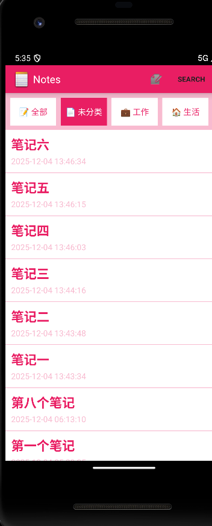
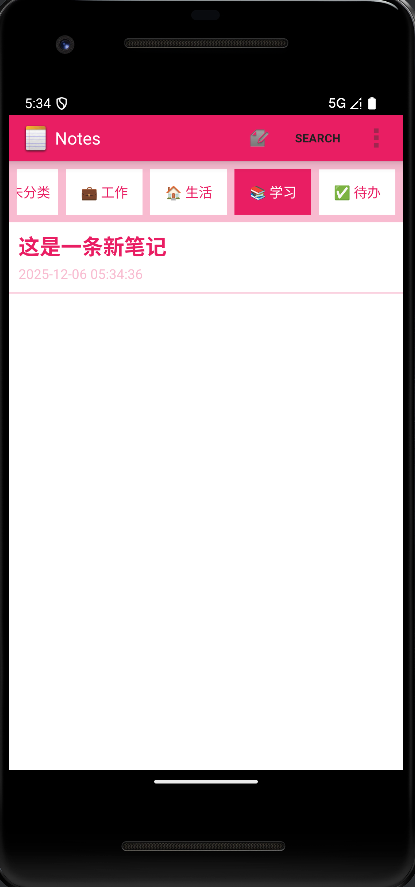
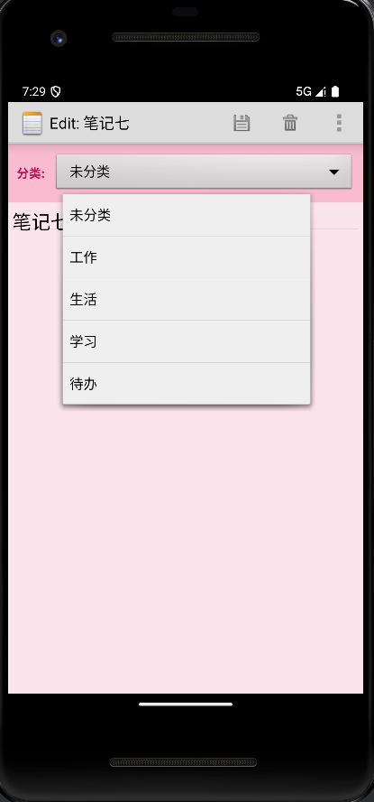
3.2 笔记代办功能
**功能介绍**：支持将笔记设置为代办事项，标记完成状态，帮助用户管理任务。
**实现思路**：为笔记添加完成状态字段，在列表中显示复选框，支持标记完成/未完成。
**技术实现**：
- 数据库中使用 `COLUMN_NAME_IS_COMPLETED` 字段存储完成状态
- 在 `NoteEditor.java` 中添加优先级选择功能
- 在 `NotesList.java` 中为代办笔记显示复选框
- 支持点击复选框切换完成状态，并更新数据库
- 完成的代办事项会显示删除线效果
**核心代码**：
```java
// 在 NotePad.java 中定义数据库字段
public static final String COLUMN_NAME_IS_COMPLETED = "is_completed";
public static final String COLUMN_NAME_PRIORITY = "priority";

// 在 NoteEditor.java 中设置优先级选择器
mPrioritySpinner = (Spinner) findViewById(R.id.priority_spinner);
mPriorityContainer = findViewById(R.id.priority_container);

// 设置优先级适配器
ArrayAdapter<CharSequence> priorityAdapter = ArrayAdapter.createFromResource(
        this, R.array.priorities, android.R.layout.simple_spinner_item);
priorityAdapter.setDropDownViewResource(android.R.layout.simple_spinner_dropdown_item);
mPrioritySpinner.setAdapter(priorityAdapter);

// 分类和优先级的联动显示
mCategorySpinner.setOnItemSelectedListener(new AdapterView.OnItemSelectedListener() {
    @Override
    public void onItemSelected(AdapterView<?> parent, android.view.View view, int position, long id) {
        String category = parent.getItemAtPosition(position).toString();
        if ("待办".equals(category)) {
            mPriorityContainer.setVisibility(android.view.View.VISIBLE);
        } else {
            mPriorityContainer.setVisibility(android.view.View.GONE);
        }
    }

    @Override
    public void onNothingSelected(AdapterView<?> parent) {
        mPriorityContainer.setVisibility(android.view.View.GONE);
    }
});

// 在 NotesList.java 中显示和处理复选框
@Override
public void bindView(View view, Context context, final Cursor cursor) {
    super.bindView(view, context, cursor);
    
    // 获取视图
    CheckBox checkBox = (CheckBox) view.findViewById(R.id.checkbox_completed);
    android.widget.TextView titleView = (android.widget.TextView) view.findViewById(android.R.id.text1);
    android.widget.TextView priorityView = (android.widget.TextView) view.findViewById(R.id.text_priority);
    
    // 获取数据
    final long noteId = cursor.getLong(cursor.getColumnIndex(NotePad.Notes._ID));
    String category = cursor.getString(cursor.getColumnIndex(NotePad.Notes.COLUMN_NAME_CATEGORY));
    int isCompleted = cursor.getInt(cursor.getColumnIndex(NotePad.Notes.COLUMN_NAME_IS_COMPLETED));
    String priority = cursor.getString(cursor.getColumnIndex(NotePad.Notes.COLUMN_NAME_PRIORITY));
    
    // 为待办事项显示复选框和优先级
    if ("待办".equals(category)) {
        checkBox.setVisibility(View.VISIBLE);
        checkBox.setChecked(isCompleted == 1);
        
        // 处理复选框点击事件
        checkBox.setOnClickListener(new View.OnClickListener() {
            @Override
            public void onClick(View v) {
                toggleTodoCompletion(noteId, ((CheckBox) v).isChecked());
            }
        });
        
        // 显示优先级标签
        if (priority != null && !priority.equals("中")) {
            priorityView.setVisibility(View.VISIBLE);
            priorityView.setText(priority);
            if ("高".equals(priority)) {
                priorityView.setBackgroundColor(0xFFD32F2F); // Red
            } else if ("低".equals(priority)) {
                priorityView.setBackgroundColor(0xFF9E9E9E); // Gray
            }
        } else {
            priorityView.setVisibility(View.GONE);
        }
        
        // 为已完成的待办事项添加删除线
        if (isCompleted == 1) {
            titleView.setPaintFlags(titleView.getPaintFlags() | Paint.STRIKE_THRU_TEXT_FLAG);
            titleView.setTextColor(0xFF9E9E9E); // Gray
        } else {
            titleView.setPaintFlags(titleView.getPaintFlags() & ~Paint.STRIKE_THRU_TEXT_FLAG);
            titleView.setTextColor(0xFFE91E63); // Pink
        }
    } else {
        checkBox.setVisibility(View.GONE);
        priorityView.setVisibility(View.GONE);
    }
}

// 切换待办事项完成状态
private void toggleTodoCompletion(long noteId, boolean isCompleted) {
    ContentValues values = new ContentValues();
    values.put(NotePad.Notes.COLUMN_NAME_IS_COMPLETED, isCompleted ? 1 : 0);

    Uri noteUri = ContentUris.withAppendedId(NotePad.Notes.CONTENT_URI, noteId);
    getContentResolver().update(noteUri, values, null, null);

    // 刷新列表
    loadNotes(mCurrentCategory);
}
```
[笔记代办功能] 实现效果截图：
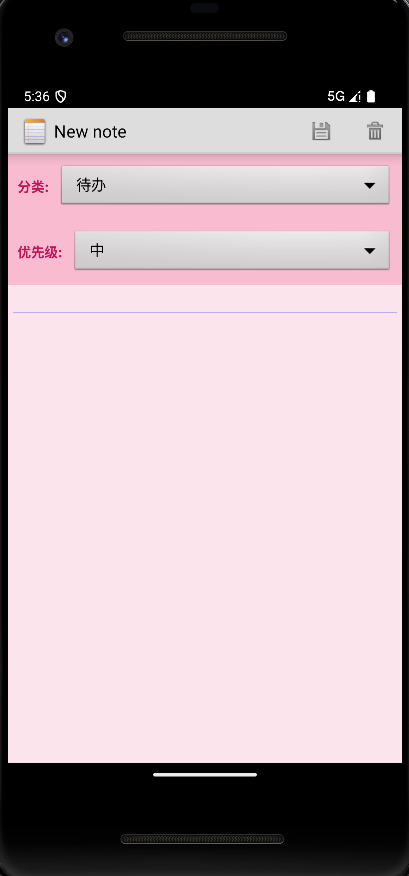
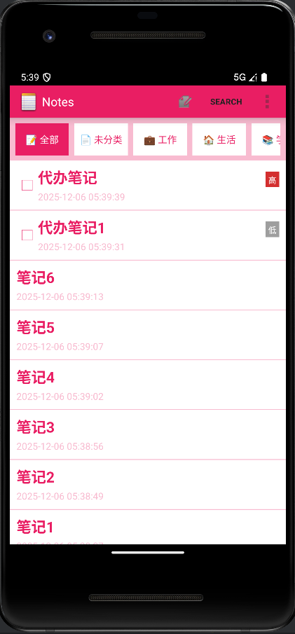
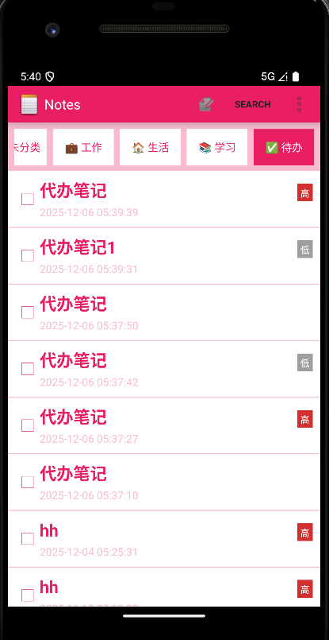